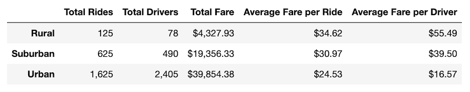
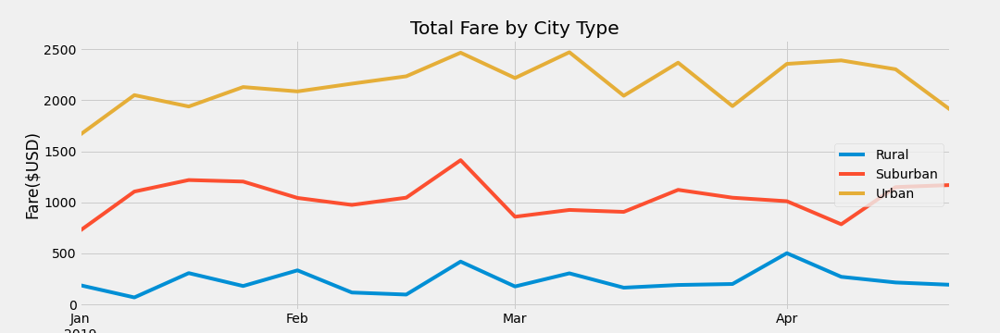

# Hitchin' A Ride

## Overview
Having analyzed the PyBer data to calculate the total number rides, average fare and average number of drivers for each city type, I have been tasked with providing a summary DataFrame of this information and creating a visualization showing the weekly fares for each city type. This analysis may help Pyber make decisions about the best way to utilize their resources each week by encapsulating how the data differs accoring to the type of city. 

---
## Results
The analysis of the original PyBer data revealed the following results for the ride data per city type:

### Totals Per City Type
The rides for *Urban* cities was by far the highest with a total of 1,625 rides. Based on the need for more rides in urban areas, it stands to reason why the total drivers for *Urban* cities was by far the highest with a total of 2,405 drivers and the total fares was the highest at $39,854.38. The lower demand of 625 rides for *Suburban* cities caused the total of drivers for *Suburban* cities to drop to 490 drivers and the total fare to drop to $19,356.33. Lastly, the *Rural* cities had the lowest total numbers. In *Rural* cities, there were a mininsucle 125 total rides, 78 total drivers and $4,327.93 in total fares. 

### Averages Per City Type
The differences in the data are very apparent in the averages per city. The average fare per ride for *Urban* cities is the lowest at $24.53 as well as the average fare per driver, which is $16.57. For *Suburban* cities, the average fare per ride is slightly higher at $30.97, but the average fare per driver is much higher at $39.50. Meanwhile, the averages for *Rural* cities are by far the highest. The average fare per ride is $34.62 and the average fare per driver is incredibly high at an astronomical $55.49 per driver. 

### Total Fare Per City Type
I, also, analyzed the total fares per city type for months of January through April of 2019:

Dividing the total fares among each month allowed me to see how the total fares changed for each city type during those months of the year. Comparing the totality of the total fares for *Urban* cities also allowed me to assess the demand for rides for each city type during that time period. For the *Urban* cities, their highest total fares were from late February to early March, which could mean that their highest demand for rides is in that same time period. Similarly, the *Suburban* cities had their highest total fares at the end of February. The *Rural* cities, however, had their highest total fares at the beginning of April.

---
## Summary
Analyzing the data does make it apparent that some changes in how PyBer distributes its resources can help it be more profitable. 

First of all, there is a disproportionate amount of drivers for the *Urban* cities. There were a total of 2,405 drivers for only a total of 1,625 rides. Allocating a bit more drivers to the *Suburban* and *Rural* cities may help cover some of the demand in those cities and drop the average fare per ride and may lead to more rides being taken in *Suburban* and *Rural* cities.

Second of all, adjusting the amount of drivers for each city type according to the time of the year may be wise. The highest total fares for both *Urban* and *Suburban* cities occur in late February and having more drivers in those areas may boost profitability since the higher total fare total could signify more demand in those areas. While the total fare for *Suburban* cities craters in early March, the total fares for *Urban* cities spikes again in that same time period, so moving the drivers from the *Suburban* cities to the *Urban* cities can help optimize the profitability in both areas.

Lastly, the total fares for *Rural* cities is the highest at the beginning of April. Allocating more resources there during this time can help to offset the disproportionate amount of drivers in *Urban* cities and increase the profits in *Rural* cities.   
